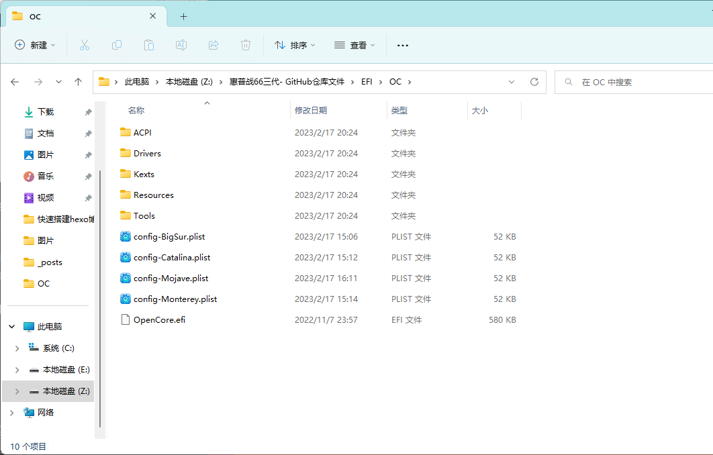
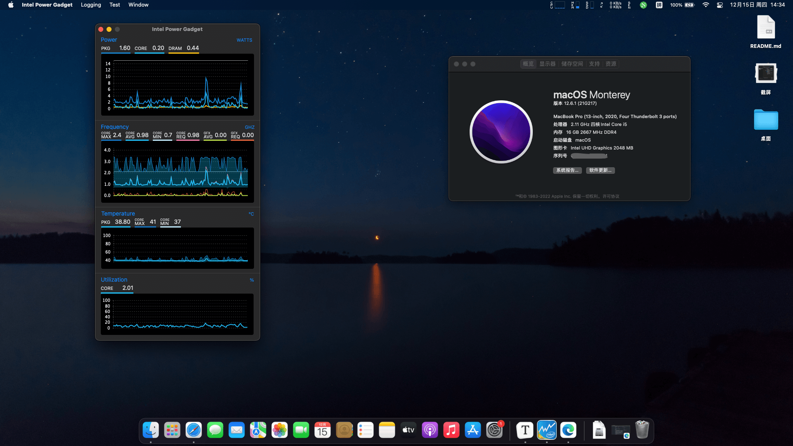
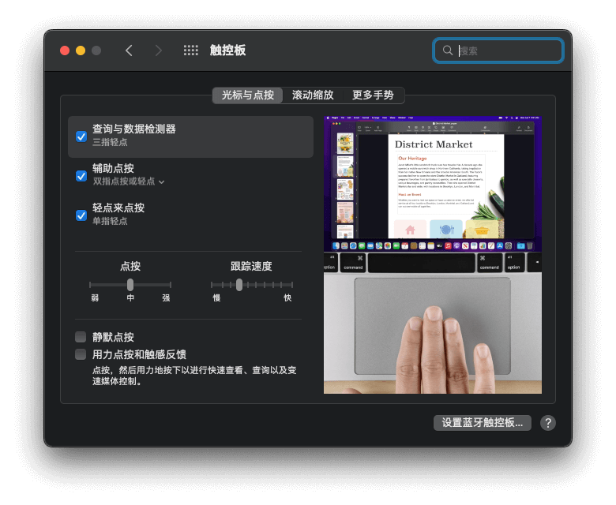
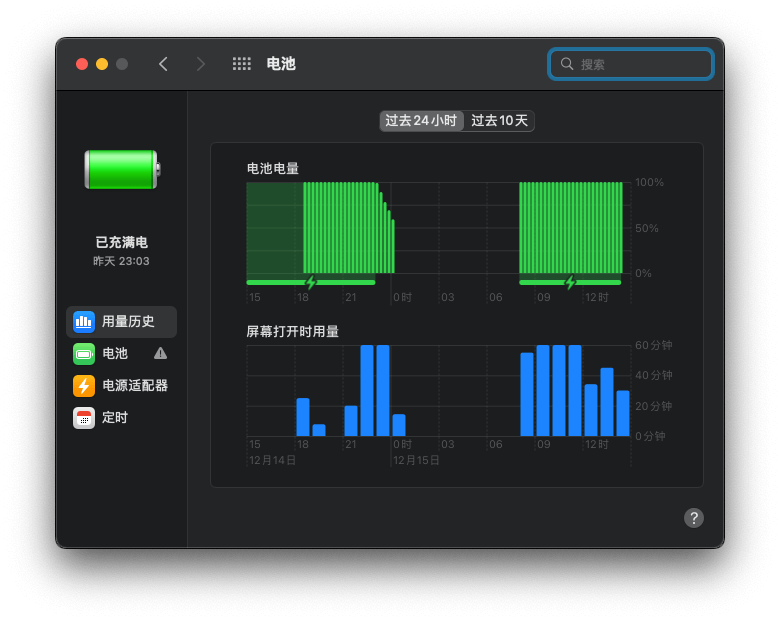
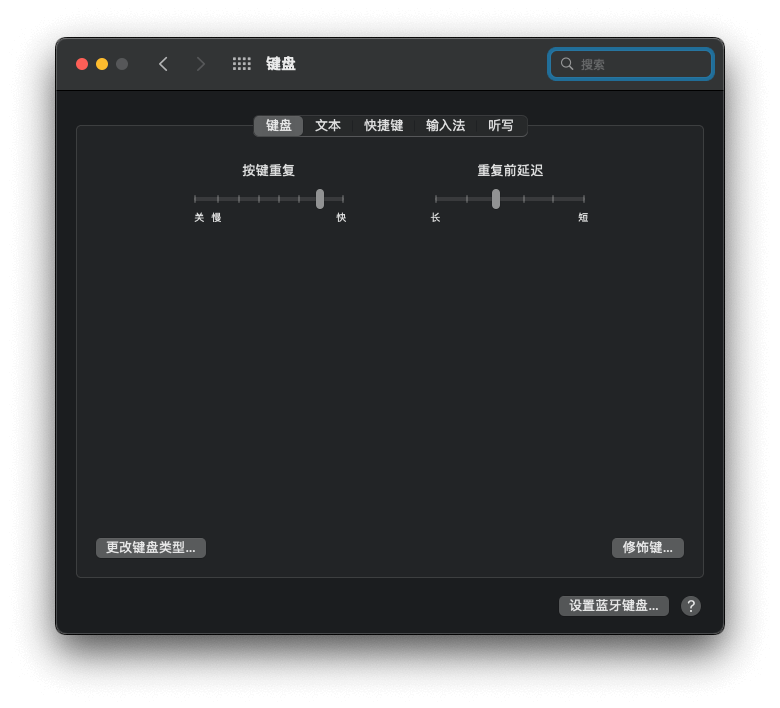
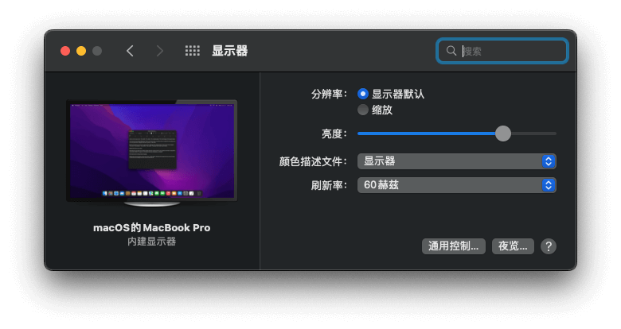
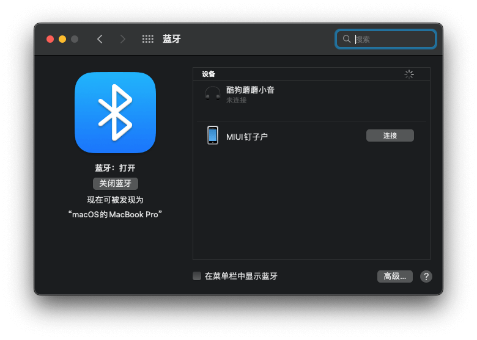
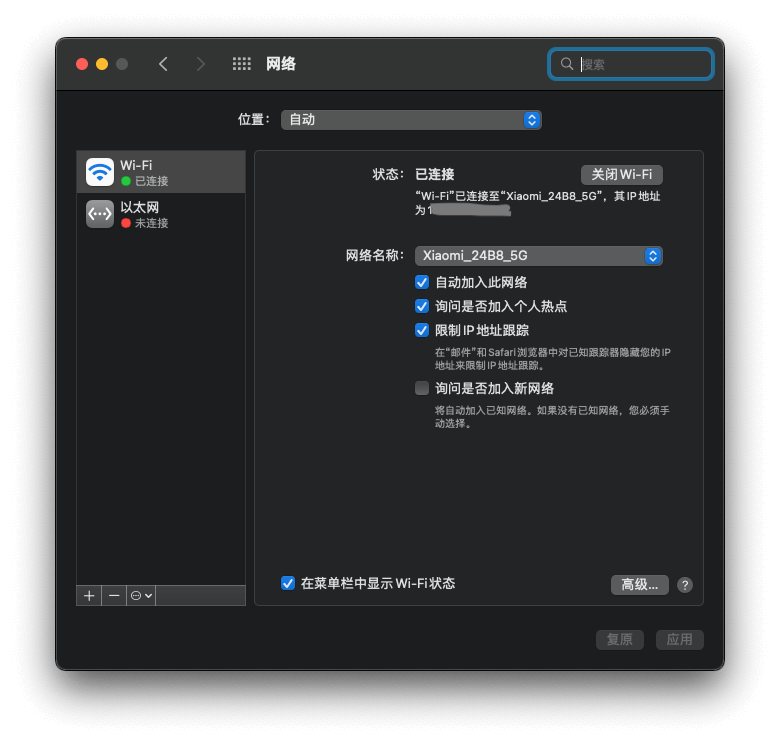

## 惠普战66三代-黑苹果-OC引导

------

**本人电脑配置：**

**电脑型号：HP ZHAN 66 Pro 14 G3**

**CPU：英特尔 Core i5-10210U @ 1.60GHz 四核**

**GPU：Intel UHD Graphics**

**主硬盘（M.2）：WDC PC SN720（安装黑苹果的时候要注意自己的硬盘是否支持安装黑苹果，有些硬盘无法安装黑苹果，比如三星的PM981A，如果自己的硬盘是这个型号的需要更换成别的硬盘）**

**副硬盘（SATA）：金士顿A400**

**声卡：英特尔智音技术音频控制器 （ALC236）**

**Wi-Fi：AX210** 

**独显：Nvidia GeForce MX250 ( 2 GB )**

**显示器： LG LGD0619 ( 14 英寸 1080p)**

## 资料

------

- 国内的用户如果下载比较慢则可以去我的[Gitee](https://gitee.com/mao-design/HP_ZHAN_66_G3_OC_EFI)仓库上下载

- 哔哩哔哩视频：[惠普战66三代黑苹果OC-EFI分享_哔哩哔哩_bilibili](https://www.bilibili.com/video/BV1j54y1w7y7/?spm_id_from=333.999.list.card_archive.click&vd_source=207adfe24392140f033825e8f4537f32)
- 黑苹果基本安装文档：[黑苹果基本安装指南 | Mao-Design的博客 (gitee.io)](https://mao-design.gitee.io/2022/10/29/黑苹果/黑苹果/)
- 国光的黑苹果安装指南：[主页 - 国光的黑苹果安装教程](https://apple.sqlsec.com/)

------

## 须知

**目前使用的是BigSur11.6.5 ，且支持 Monterey**

> 我这里准备了Mojave、Catalina、BigSur、Monterey的config配置文件，需要使用那个系统，则修改对应的config配置文件即可，比如我要使用BigSur，只需要把 `config-BigSur.plist` 改为 `config.plist` 即可

> 系统则推荐每个大版本的最后几个小版本，比如Mojave10.14.6、Catalina10.15.6、BigSur11.6.5、Monterey12.6.1，而最新版的系统展示不推荐，再加上这个笔记本在黑苹果上只能驱动核显，所以版本越高对电脑的性能要求越高

> **我目前使用的是BigSur11.6.5，感觉BigSur要稳定一点（不怎么打算升级系统，只要没什么问题，就不打算动EFI，所以也就不会升级OC版本以及驱动）** 

## 一些问题

> Mojave没有安装过，因为太老了，所以我没有安装，如果你想安装这个系统，则可以使用我准备好的 `config-Mojave.plist` 这个配置文件试试看，如果不能安装，你可以自己在黑苹果虚拟机上进行调试，或者在Windows下使用 `ProperTree` 这个小工具进行修改

> Catalina上 `AirportItlwm.kext` 如果不能正确驱动的话则可以参考该视频：[手把手教你在绝大部分macOS下驱动intel网卡！—— Intel网卡套娃IO80211Family教程_哔哩哔哩_bilibili](https://www.bilibili.com/video/BV1QL411J7Nf/?spm_id_from=333.337.search-card.all.click&vd_source=207adfe24392140f033825e8f4537f32) ，但我没有试过，如果你感兴趣你可以去看看，如果你实在搞不懂，则可以取消勾选 `AirportItlwm.kext` 转而使用 `itlwm.kext` （这个驱动需要配合 HeliPort（https://wwwl.lanzouw.com/izcU90nuztwf 密码:1xh6） 这个软件才可以使用），还有Catalina上可能有电池显示问题（**就是不提示低电量，要么就是满电的情况下提示低电量；**我在网上看见一种解决方法，那就是添加 `ECEnabler.kext + ACPIBatteryManager.kext + LIDPatch.aml` ，但我没有试过，有兴趣的可以自己试一下）

> BigSur以上的系统则支持的不错，没有什么大问题，电池什么的都可以正常显示

------

## 黑苹果完成度

**CPU：已睿频**

**显卡：仿冒UHD630**

**WI-FI：OK**

**触摸板：HID支持 （支持多指触控）**

**电池显示：可以**

**显示器亮度：可以 （可调节，快捷键：fn+f3减小亮度，fn+f4增加亮度）**

**蓝牙： 已支持**

**USB：已定制（因为我没有type-c的设备，所以没有定制type-c接口，一般就是拿来充电用的）**

如果你想使用type-c，具体可以查看国光的USB定制教程[USB 定制 - 国光的黑苹果安装教程](https://apple.sqlsec.com/6-实用姿势/6-1/)）

**声卡：OK**

**麦克风：内建麦克风无解，解决方法是外接麦克风**

**有线网卡：BigSur下实测可用，Monterey下没有测试过（主要是不怎么用）**

**SD卡：没测（不整么用）**

**HDMI投影：可以（插上之后笔记本屏幕会黑屏，需要盖上笔记本屏幕等HDMI屏幕黑屏之后在打开笔记本屏幕）**

**显卡：Nvidia GeForce MX250 已屏蔽**

**指纹：不支持**

## BIOS设置

惠普战66三代BIOS快捷键：开机F10即可进入

- 关闭快速启动
- 关闭安全启动（不然无法进入OC）
- DVMT 调整到64MB以上
- 关闭 Intel SGX
- 关闭特殊键映射至Fn+按键（如果这个选项不关闭，会有一个问题就是Fn+F3键会映射到Fn+C键，就导致**快捷键重复**，所以这个没必要开启）
- 开启最佳DC性能（可以选择不开，据说这个是增加电脑整体性能的）

## 补丁和驱动

### 补丁

| 补丁名称             | 作用                                                         |
| :------------------- | ------------------------------------------------------------ |
| SSDT-ALS0.aml        | 添加虚拟的环境光传感器以在重启后保存之前亮度设置             |
| SSDT-OCBAT0-HP.aml   | 惠普机的电池补丁，来自                                       |
| SSDT-GPI0-GPHD.aml   | 触控板连接修复                                               |
| SSDT-AWAC.aml        | 修复RTC禁止AWAC                                              |
| SSDT-DMAC.aml        | 将DMA控制器公开给系统                                        |
| SSDT-EC-USBX.aml     | 用于修复嵌入式控制器                                         |
| SSDT-HP-060D.aml     | 休眠补丁（这个补丁相当于是SSDT-GPRW.aml对惠普机的定制版）    |
| SSDT-MCHC.aml        | 修复 SMBus 支持，解决 温度、风扇、电压等读数问题（和SSDT-SBUS.aml一起使用） |
| SSDT-MEM2.aml        | 仿冒 MEM2                                                    |
| SSDT-NDGP_OFF.aml    | 屏蔽独显                                                     |
| SSDT-PLUG.aml        | 启用原生电源管理                                             |
| SSDT-PMCR.aml        | 开启节能五项                                                 |
| SSDT-PNLFCFL.aml     | 修复笔记本亮度控制                                           |
| SSDT-PPMC.aml        | 添加 PPMC                                                    |
| SSDT-PTSWAKTTS.aml   | 修复关机/睡眠问题                                            |
| SSDT-RMCF-PS2Map.aml | 键盘按键映射                                                 |
| SSDT-SBUS.aml        | 修复 SMBus 支持，解决 温度、风扇、电压等读数问题（和SSDT-MCHC.aml一起使用） |
| SSDT-TPDX.aml        | 触控板补丁                                                   |

### 驱动

| 驱动名称                    | 作用                                                         |
| --------------------------- | ------------------------------------------------------------ |
| ACPIBatteryManager.kext     | 配合ACPI电池补丁，来显示电池电量，如遇五国卡BATO之类的请删除 |
| AirportItlwm-BigSur.kext    | 网卡驱动BIgSur版                                             |
| AirportItlwm-Catalina.kext  | 网卡驱动Catalina版                                           |
| AirportItlwm-Mojave.kext    | 网卡驱动Mojave版                                             |
| AirportItlwm-Monterey.kext  | 网卡驱动Monterey版                                           |
| AppleALC.kext               | 声卡驱动                                                     |
| BlueToolFixup.kext          | 蓝牙驱动（Monterey之后的系统用的）                           |
| CpuTscSync.kext             | CPU多核心和TSC同步核心驱动                                   |
| DebugEnhancer.kext          | macOS内核调试输出驱动                                        |
| ECEnabler.kext              | 电池辅助驱动，允许读取长度超过 1 个字节（8bit）的嵌入式控制器 |
| IntelBluetoothFirmware.kext | 黑苹果英特尔蓝牙驱动                                         |
| IntelBluetoothInjector.kext | 用于修复系统设置内的蓝牙开关                                 |
| IntelMausi.kext             | 英特尔板载有线以太网卡                                       |
| itlwm.kext                  | 网卡驱动，需要配合软件 `HeliPort`                            |
| Lilu.kext                   | 内核驱动                                                     |
| NoTouchID.kext              | 用于关闭 TouchID 支持                                        |
| NVMeFix.kext                | 提升黑苹果系统NVMe硬盘兼容性的驱动                           |
| RealtekRTL8111.kext         | Realtek 的千兆网卡驱动                                       |
| RestrictEvents.kext         | 作用是关于本机中 CPU 名称、核心和线程正确显示                |
| RTCMemoryFixup.kext         | 模拟CMOS(RTC)内存中offsets(偏移量)的方法,以避免 macOS AppleRTC 和PC的 固件/BIOS 之间的某些冲突 |
| SMCBatteryManager.kext      | 笔记本专用，用于正确读取显示电池容量                         |
| SMCProcessor.kext           | 用于监控 CPU 温度，`台式机`和笔记本都适用                    |
| SMCSuperIO.kext             | 用于监控风扇的转速，`台式机`和笔记本都适用                   |
| USBToolBox.kext             | 定制USB和 `UTBMap.kext` 一起使用                             |
| UTBMap.kext                 | 定制USB和 `USBToolBox.kext` 一起使用                         |
| VirtualSMC.kext             | 模拟白苹果的 SMC 芯片                                        |
| VoodooI2C.kext              | 用于修复 I2C 设备的触控板驱动                                |
| VoodooI2CHID.kext           | 加了对 I2C-HID 设备的支持                                    |
| VoodooPS2Controller.kext    | 适用于配备 PS2 键盘、鼠标和触控板的系统                      |
| WhateverGreen.kext          | 核显驱动                                                     |

## 感谢🙏

**gxzzzzzzzzz ：https://github.com/gxzzzzzzzzz/HP_zhan66_pro_14_g3**

**xiaoshimu ：https://github.com/xiaoshimu/macos-opencore-hp-zhan66-pro15-g3-i7-10510u**

**Ronein：https://github.com/Ronein/HP-ZHAN-66-Pro-14-G3-OC-EFI** 

**lietxia：https://github.com/lietxia/XiaoXinAir14IML_2019_hackintosh（因为联想小新air14的配置和我笔记本的配置很接近，所以也参考了一些）**

**我是基于Ronein大佬的文件，做的调整。**

## 参考图片：

